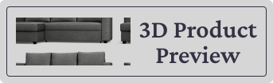
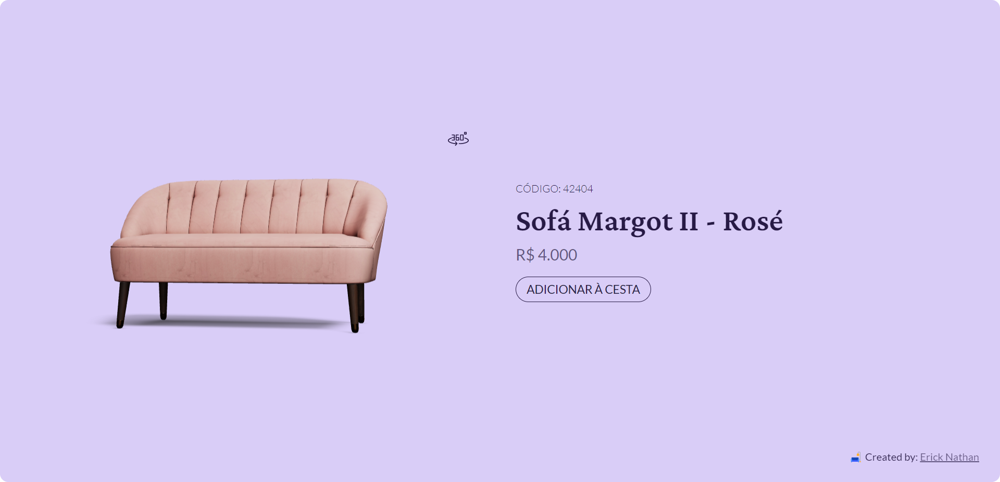

<div align="center">
   
</div>

# 3D Product Preview
3D Product Preview is a web application that allows users to preview the "Margot II Rose" sofa in 3D before making a purchase. With a modern and intuitive interface, the platform offers an immersive and interactive experience, enabling users to view the product in 3D.

It was developed with a didactic approach to learn about the ThreeJS library and how to create real-time 3D model visualizations using JavaScript.

## Used technologies
- [Vite](https://vitejs.dev/) for the build and development of the application.
- [Svelte](https://svelte.dev/) for build the user interface.
- [TypeScript](https://www.typescriptlang.org/) for data typing.
- [SASS](https://sass-lang.com/) for styling components.
- [Three.js](https://threejs.org/) for running 3D models in the browser.
- [Threlte](https://threlte.xyz/) for rendering three.js scenes in Svelte.

## Demo
The application is available for public access at: [3d-product-preview.vercel.app](https://3d-product-preview.vercel.app/)



## Running locally

### How to run the application
To run the application, you need to have [Node.js](https://nodejs.org/en/) installed on your computer. After that, just clone the repository, enter the application directory and use the following commands in your terminal:

```bash
# Installing dependencies
$ npm install

# Executing the application
$ npm run dev
```

### How to generate and run the application build locally
To generate and run the application build, just use the following command in the terminal:

```bash
# Generate the application build
$ npm run build

# Run the application build preview
$ npm run preview
```

---

😁 Project developed by [Erick Nathan](https://www.linkedin.com/in/ericknathan/).

[⬆ Back to the top](#3d-product-review)<br>